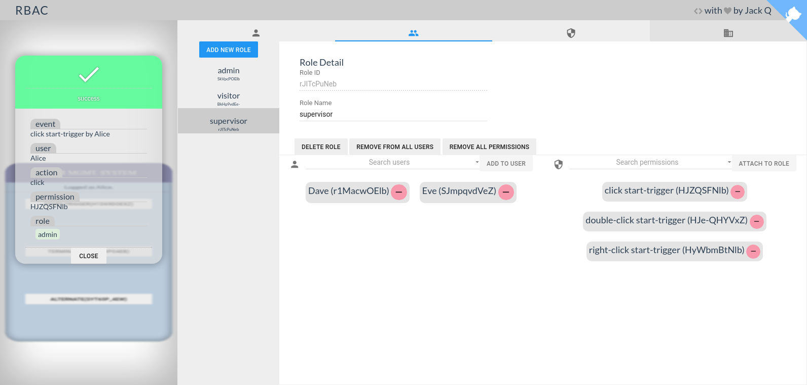
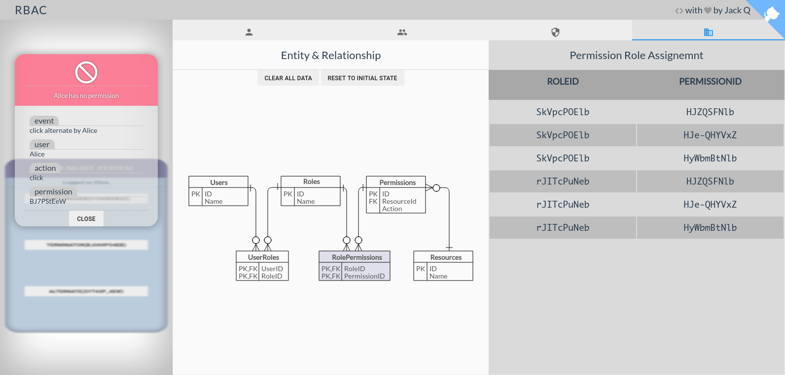

# RBAC: Role-Based Access Control

> A demonstration of Role Based Access Control

##  Introduction

*RBAC* is an approach to inspect and restrict access to system implemented 
as organizing individuals with an abstract layer (i.e. manage *users* 
indirectly via *roles*). A minimal design confronting this approach may 
involve 3 entities (`user`, `role`, `permission`)
 and 2 many-to-many connections (`user` to `role`, `role` to `permission`).
To focus on the cor concepts of *RBAC*, this demonstration illustrates 
this model with a set of minimal virtual tables covering the entities and
connections listed above. (shows as the following E-R diagram)


## Preview

* visit [git.io/rbac](https://git.io/rbac)





## Build Setup

``` bash
# install dependencies
npm install

# serve with hot reload at localhost:8080
npm run dev

# build for production with minification
npm run build

```
